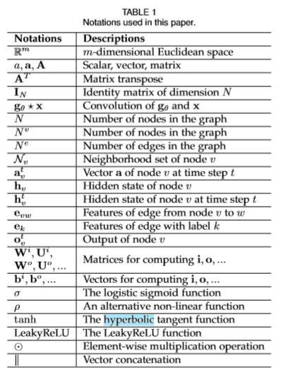
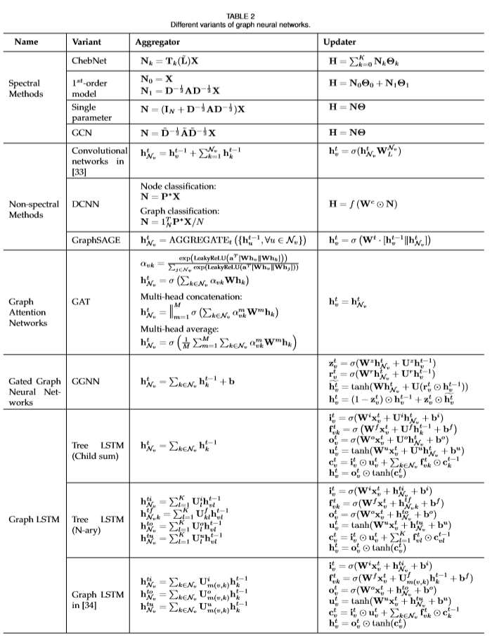
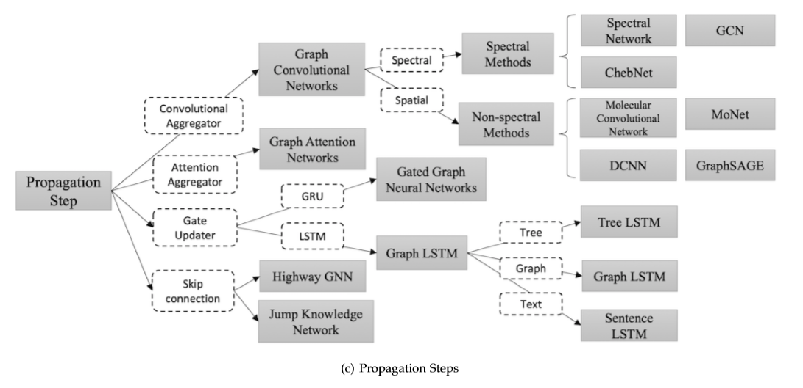
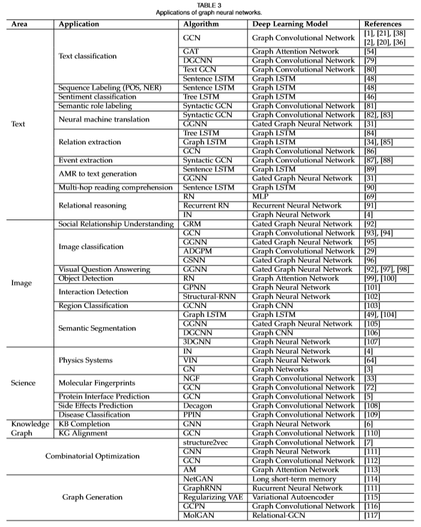
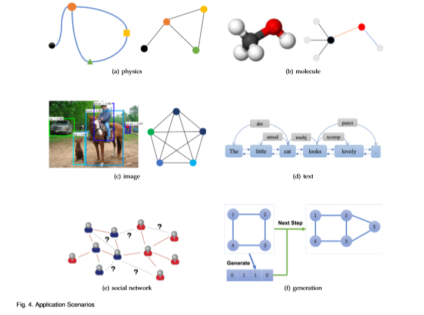

# What-Is-Graph-Neural-Network?
This project aims to collect all knowledge points related to graph neural network (basic knowledge, key points analysis of the paper, etc.).
# 前言
- 有关图网络的中文资料太少了 😐 本项目意在收集所有与图神经网络有关的知识点（基础知识、论文要点解析等）。🌴独木不成林，独林不成森。如果您有想要分享的相关知识点或论文要点概括，欢迎 fork 或 直接发 issue，可提供昵称与联络方式，所有被收录的知识点整理或解析提供者将被记录在文末，整理资料时请一并提供引文出处。能力有限，无法保证所收录内容的绝对准确性，如有疑问或指教，期待与您 issue 相见 ⛄。
- 图网络研究交流QQ群：832405795

# 十万个为什么
本栏目收集所有图网络相关问答 🤡，若您有任何关于图网络的不解之处，欢迎发issue，此处将收录优质提问与解答(如果是某篇特定图网络论文的问题发issue时请标上论文序号或名字，问答将被收录在对应 readme 中)。如果您有意愿分享图网络相关问题的解答，欢迎 fork→PR 或 issue。

## 1. 什么是GNN？
- 图是一种数据结构，它对一组对象（节点）及其关系（边）进行建模。图神经网络（GNN）是一类基于深度学习的处理图域信息的方法。由于其较好的性能和可解释性，GNN 最近已成为一种广泛应用的图分析方法。

## 2. GNN具有哪些优势？
- 图网络可以处理非欧几里得数据。标准的CNN和RNN网络不能处理图输入这种非顺序排序的特征表示。换句话说，图中节点的排序是没有规律可言的。如果非要用传统的CNN和RNN来处理图数据的话，只能遍历图中节点所有可能的出现顺序作为模型的输入，这对模型的计算能力来说是难以承受的。GNN分别在每个节点上传播，忽略了节点之间输入的顺序。换而言之，GNN的输出是不随节点的输入顺序为转移的。

- 图中的边表示两个节点之间的依赖关系。在传统的神经网络中，这种依赖关系只能通过节点的特征表示来体现。GNN可以依赖周围的状态来更新节点的状态。
- 推理能力，与人类从日常经验中获取推理能力相似，GNN能够从非结构化数据（例如:场景图片、故事片段等）中生成图。与之对比的是，传统CNN和RNN能够从大量经验数据中生成完整的图片和文档，但并不能学习出这种推理图（reasoning graph）。
## 3. GNN存在哪些不足？

## 4. GNN的应用有哪些？

## 5. GNN方向常用数据集有哪些？
# 论文要点解析
## 1. [Graph Neural Networks: A Review of Methods and Applications](https://arxiv.org/pdf/1812.08434.pdf)
### 符号表

### 要点记录
- 卷积神经网络（CNN）是GNN起源的首要动机，CNN只能应用于常规的欧几里得数据上（例如2-D的图片、1-D的文本），这些形式的数据可以被看成是图的实例化。随着对GNN和CNN的深入分析，发现其有三个共同的特点：（1）局部连接（2）权值共享（3）多层网络。这对于GNN来说同样有重要的意义。（1）局部连接是图的最基本的表现形式。（2）权值共享可以减少网络的计算量。（3）多层结构可以让网络捕获不同的特征。然而，从CNN到GNN的转变还面临着另一个问题，难以定义局部卷积核和池化操作。
- 图嵌入（DeepWalk、RandomWalk等）存在两个缺点：（1）图中节点之间不存在任何的参数共享，导致计算量与节点数量呈线性增长。（2）图嵌入技术缺乏泛化能力，导致不能处理动态图或推广至新的图。
- 原始 GNN
  - 在图中，每个节点的定义是由该节点的特征和相关节点来共同表示的。GNN的目标是训练出一个state embedding函数hv，该函数包含了每个节点的领域信息。`hv = f(xv,xco[v],hne[v],xne[v]) （1）` hv是节点v的向量化表示，它可以被用来去预测该节点的输出ov（例如节点的标签）。`f（*）`被称为local transition function，它被所有的节点共享，并根据输入的领域信息来更新节点的状态。xv是节点v的特征表示，xco[v]是v节点上边的特征表示，hne[v]是该节点的状态，xne[v] 是节点v周围节点的特征表示。
  - `ov = g(hv,xv) (2) `中`g（*）`被称为local output function，它是用来产生节点的输出的。
  - `H = F(H,X) (3)    O = G(H,XN) (4) `H、O、X、XN为其推广形式，代表图中的所有对象的堆叠形式。
  - Banach的fixed point提出以后，GNN中state的迭代计算过程可以表示为：`Ht+1 = F(Ht,X) (5) `Ht代表H的第t次迭代的状态，H（0）代表其动态方程的初始状态。
  -  对于一个GNN网络来说，其训练过程就是学习出函数`f（*）`和`g（*）`，tv代表节点v的标签，GNN的优化过程为：
  - Limitations：实验结果表明GNN对于结构化数据的建模十分有效，但仍然存在着诸多的不足。
    a. 对于不动点隐藏状态的更新是十分低效的。如果放松对不动点的假设，论文中提出一种多层GNN可以得到节点及其邻域的稳定表示。
    b. GNN在迭代的过程中用相同的参数，然而大多标准网络在不同的网络层数使用不同的参数，
    c. 在原始的GNN中存在着一些无法有效建模的边缘信息特征。例如，在知识图谱中边代表这关系类型，不同边缘的消息传递应该根据他们的类型有所不同。怎么样去学习边缘的隐藏状态也是一个重要的问题。
    d. 如果把重点放在节点的表示而不是图上，就不适合使用不动点，因为不动点上表示的分布会变得非常平滑，且每个节点的信息量也会减少。
- 在模型中，信息的传播步骤和输出步骤是获得节点或者边隐含状态的关键步骤。不同变种的GNN的聚合函数（用来聚合图中所有点的邻域信息，产生一个全局性的输出）和节点状态更新函数如下图所示：
  - Convolution：GCN将卷积操作应用到图结构的数据上，主要分为Spectral method 和 Spatial Method 两种方法。其目的都是对节点以及节点的邻近节点进行信息收集。
  - Gate：使用GRU或者是LSTM这种带有门控机制的网络，来增强信息在图结构中的长期的传播。
  - Attention：GAT是一种图注意网络，它将注意力机制融入到了图传播的步骤中。GAT计算每个节点的隐藏状态，通过将 “attention” 机制应用到邻近节点上。
  - Skip connection：研究发现更深的网络层数可以帮助网络在节点的邻域节点上获取到更多的信息。但通过实验也发现深层网络也会在网络传播中带来噪声信息，随着网络层数的加深，网络还会出现退化。基于图像领域的启发，residual network和highway network 这些skip 模型能够有效的处理这一问题。
  
- 图网络被广泛的应用于包括监督学习、半监督学习、无监督学习和强化学习等方向。论文中从三个不同的场景来分别阐述图网络的应用。（1）结构化场景：数据包含有很明确的关系结构，如物理系统、分子结构和知识图谱。（2）非结构化场景：数据不包含明确的关系结构，例如文本和图像等领域。（3）其他应用场景：例如生成式模型和组合优化模型。各个领域图网络的应用细节如下图所示： 
- 4个开放性问题
  - 浅层结构：目前GNN还只能在较浅层的网络上发挥优势，随着层数的加深，网络会出现退化。
  - 动态图：目前大多方法只能应用在静态图上，对于动态图还没有特别好的解决方案。
  - 非结构化场景：还没有一个通用的方法来合理的处理非结构化数据。
  - 扩展性：将图网络应用于大规模数据上仍然面临着不小的困难。
### 参考
- [博客译文](https://blog.csdn.net/m0_38031488/article/details/88414320)
- [Banach不动点定理](https://zhuanlan.zhihu.com/p/33885648)
### 提问
1. 如何通俗易懂地解释Banach不动点定理？它和GNN迭代过程有什么关系？
# 贡献者
注意：此处仅代表知识点整理或答题贡献，不代表内容全部原创，整理资料时请一并提供引文出处。此处排名不分先后，仅按时间顺序排列。
- Knife丶 QQ：1272068154 微信：ly18597591102
