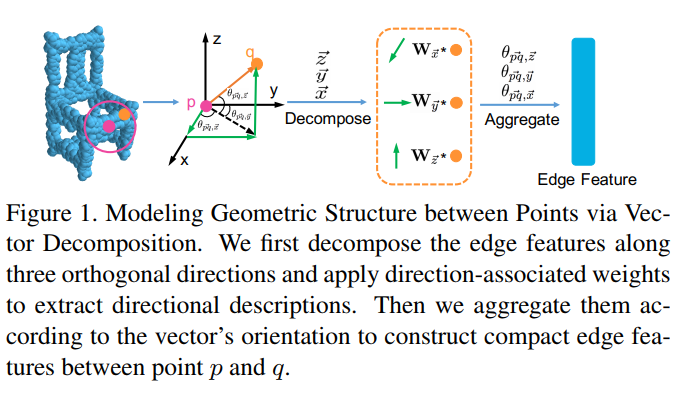
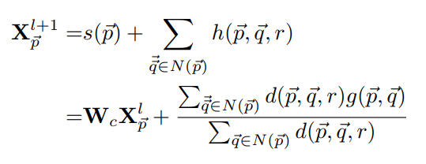

# [Modeling Local Geometric Structure of 3D Point Clouds using Geo-CNN](https://arxiv.org/abs/1811.07782)

## 背景

- 作者认为直接以边向量通过MLP获得权重容易过拟合，因为边的组合多变，方差大；另外，直接映射至高维空间有可能丢失原有的几何结构，因此需要关注显式几何结构建模
- 改造局部点云中邻点与中心点的特征提取方式：首先将边缘特征提取过程分解成三个正交的基，然后根据边缘向量与基之间的夹角对提取的特征进行聚合。这鼓励了网络在整个特征提取层次中保持欧氏空间的几何结构。
## 模型流程

- 
## 要点记录
### What
1. 
### How
1.
### Why
1.
### Result
- 
### Drawbacks
- 
## 参考
- 
## 疑惑
1. 为什么显式建模更有效？
2. 这种操作是怎么减轻过拟合的？
3. 为什么将坐标轴分为正负轴，构造8个基向量？
