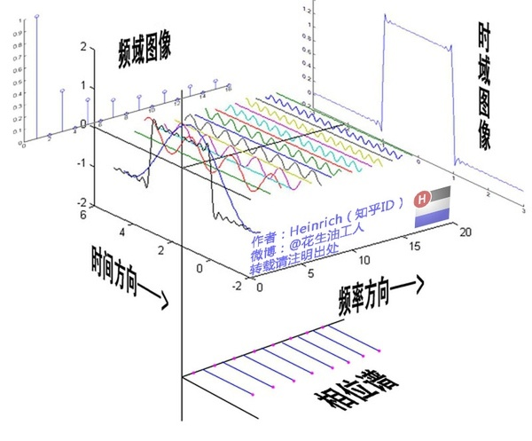
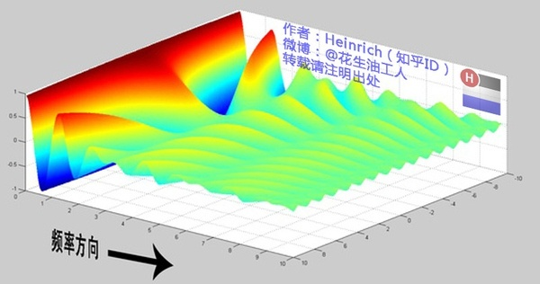

# [SEMI-SUPERVISED CLASSIFICATION WITH GRAPH CONVOLUTIONAL NETWORKS](https://arxiv.org/pdf/1609.02907.pdf)

- 作者提出了一种可扩展的基于图数据结构的半监督学习方法，该方法基于一个有效的卷积神经网络变种，这种变种能够直接对图进行操作。通过光谱图卷积的局部一阶近似来确定卷积网络结构的选择。模型在图的边的数量上线性缩放，并可以学习隐藏层表示，这些表示既编码局部图结构，也能够编码节点的特征。
## 背景
- CNN中的卷积：

- 傅里叶变换：
  - 傅里叶级数

  
  
  傅里叶级数实际上是对一个周期函数进行分解，一个周期函数可以看作是无穷个正弦函数的组合，我们将每个不同的正弦函数视为一个基，将其铺开即可构成一个新的维度（频域），因此`周期函数 = 包含无穷个基函数的谱维度 + 每个基函数在数值轴上的投影（频谱） + 每个基函数在时间轴上的投影（相位谱）`，更简单地可以这样理解：一个周期函数可以分解为无穷个正弦函数，一个正弦函数可以表示为我们熟悉的公式`y = A·sin(wx + φ)`，所以我们只需要知道每个正弦函数的 A（频谱）和 φ（相位谱），即可表示任意一个周期性函数。
  
  - 时域：
  
  
  - 频域：
  
  
  
  在时域，我们观察到钢琴的琴弦一会上一会下的摆动，就如同一支股票的走势；而在频域，只有那一个永恒的音符。任何周期函数，都可以看作是不同振幅，不同相位正弦波的叠加。利用对不同琴键不同力度，不同时间点的敲击，可以组合出任何一首乐曲。
  正弦波就是一个圆周运动在一条直线上的投影。所以频域的基本单元也可以理解为一个始终在旋转的圆。
  
  
  
  从侧面看正弦波得到频域图像。
  
  
  
  在频谱中，偶数项的振幅都是0，也就对应了图中的彩色直线。振幅为 0 的正弦波。
  
  
  
  基础的正弦波A.sin(wt+θ)中，振幅，频率，相位缺一不可，不同相位决定了波的位置，所以对于频域分析，仅仅有频谱（振幅谱）是不够的，我们还需要一个相位谱。
  
  
  
  - 傅里叶变换
  
  
  
  傅里叶变换实际上是对一个周期无限大的函数进行傅里叶级数
  
  - 离散谱
  
  
  
  - 连续谱
  
  
  
- Laplacian矩阵
  - Laplacian矩阵的形式决定了特征传播的贡献权重。拉普拉斯矩阵一般有以下三种（A为邻接矩阵，D为度矩阵）：
  
  
  
  1. 非规范Laplacian矩阵中，设i为行索引，j为列索引，i = j 时表示各个节点的度；i 和 j 节点有边时为 -1；无边时为 0
  2. 
## 模型流程
- 
## 要点记录
### What
1. 
### How
1.
### Why
1.
### Result
- 
### Drawbacks
- 
## 参考
- [傅里叶变换通俗讲解](https://www.cnblogs.com/h2zZhou/p/8405717.html)
- [经典半监督图卷积神经网络Semi-GCN解读](https://zhuanlan.zhihu.com/p/58178060)
- [拉普拉斯矩阵百度百科](https://www.baidu.com/link?url=JIdfpekQVVcTu_g9Ow2_H_NVnQb0sGuytxo3LbCKO_k42YJuKdrAgdmLZMTjXcljR577ui4NrYSVI9DumUkh6GVuK0otPCrDpATBz1kJ9F42tYBMzEEBpm8_MlDnNWk3D1-lV-XptefSNYqDonLrp_&wd=&eqid=e513fd7300045e81000000065cdac6ec)
## 提问
1. 
