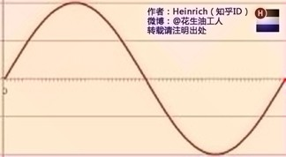
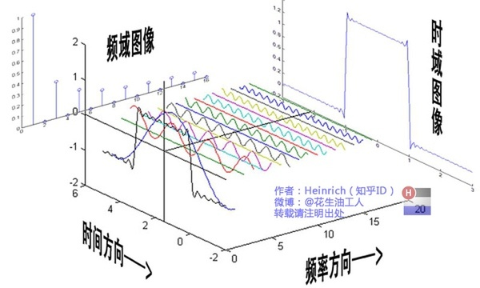
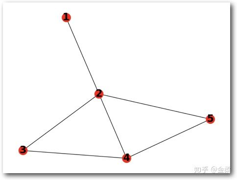
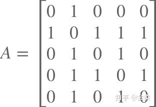
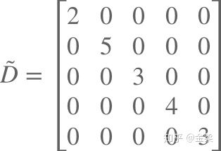
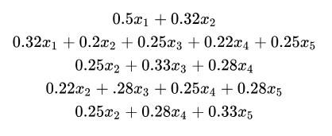

# [SEMI-SUPERVISED CLASSIFICATION WITH GRAPH CONVOLUTIONAL NETWORKS](https://arxiv.org/pdf/1609.02907.pdf)

- 本文提出了一种图卷积网络（graph covolutional networks, GCNs），该网络是传统卷积算法在图结构数据上的一个变体，可以直接用于处理图结构数据。从本质上讲，GCN 是谱图卷积（spectral graph convolution） 的局部一阶近似（localized first-order approximation）。GCN的另一个特点在于其模型规模会随图中边的数量的增长而线性增长。总的来说，GCN 可以用于对局部图结构与节点特征进行编码。
## 背景
- CNN中的卷积：

- 傅里叶变换：
  - 傅里叶级数

  
  
  傅里叶级数实际上是对一个周期函数进行分解，一个周期函数可以看作是无穷个正弦函数的组合，我们将每个不同的正弦函数视为一个基，将其铺开即可构成一个新的维度（谱域），因此`周期函数 = 包含多个基函数的谱维度 + 每个基函数在数值轴上的投影（频谱） + 每个基函数在时间轴上的投影（相位谱）`，更简单地可以这样理解：一个周期函数可以分解为多个正弦函数，一个正弦函数可以表示为我们熟悉的公式`y = A·sin(wx + φ)`，所以我们只需要知道每个正弦函数的 A（频谱）和 φ（相位谱），即可表示任意一个周期性函数。
  
  - 时域：
  
  
  - 频域：
  
  
  
  在时域，我们观察到钢琴的琴弦一会上一会下的摆动，就如同一支股票的走势；而在频域，只有那一个永恒的音符。任何周期函数，都可以看作是不同振幅，不同相位正弦波的叠加。利用对不同琴键不同力度，不同时间点的敲击，可以组合出任何一首乐曲。
  正弦波就是一个圆周运动在一条直线上的投影。所以频域的基本单元也可以理解为一个始终在旋转的圆。
  
  
  
  从侧面看正弦波得到频域图像。
  
  
  
  在频谱中，偶数项的振幅都是0，也就对应了图中的彩色直线。振幅为 0 的正弦波。
  
  
  
  基础的正弦波A.sin(wt+θ)中，振幅，频率，相位缺一不可，不同相位决定了波的位置，所以对于频域分析，仅仅有频谱（振幅谱）是不够的，我们还需要一个相位谱。
  
  
  
  - 傅里叶变换
  
  
  
  傅里叶变换实际上是对一个周期无限大的函数进行傅里叶级数
  
  - 离散谱
  
  
  
  - 连续谱
  
  
  
  - 欧拉公式（在复平面统一三角函数，可由麦克劳林展开得到）
  
  
  
  - 傅里叶变换/逆变换公式
  
  
  
  f(x)为原函数，w为频率，F(w)为f(x)的频谱（傅里叶变换），e^iwt是正交基，F(w)是关于f(t)和w的函数即f(t)在以w为频率的正交基上的系数。F(w)是复平面上的一组向量。关于f(x)的F(w)的推导，涉及到｛函数向量，函数向量的点积等｝，可参考 [无限维的希尔伯特空间](https://ccjou.wordpress.com/2009/08/18/%E5%BE%9E%E5%B9%BE%E4%BD%95%E5%90%91%E9%87%8F%E7%A9%BA%E9%96%93%E5%88%B0%E5%87%BD%E6%95%B8%E7%A9%BA%E9%96%93/)
  
- Laplacian矩阵
  Laplacian矩阵的形式决定了特征传播的贡献权重。拉普拉斯矩阵一般有以下三种（A为邻接矩阵，D为度矩阵）：
  
  
  
  非规范Laplacian矩阵中，设i为行索引，j为列索引，i = j 时表示各个节点的度；i 和 j 节点有边时为 -1；无边时为 0
  
  拉普拉斯矩阵主要是根据各个节点的度和边的关系给每个节点的每条边施加一个权重
## 模型流程
### 前向传播

上图为 GCN 的前向传播公式，在向前传播公式中有一个矩阵 ，它是根据度矩阵（加自环）和邻接矩阵（加自环）计算的，在传播开始之前可以先计算好。

 假设有一个由5个Node组成的无向图
  
 根据图结构得到邻接矩阵A
  
 在邻接矩阵A的基础上加上自环（单位对角阵I）
  
 得到度矩阵（Dii 是每个节点的邻居数，包括自身），度矩阵是个对角阵，对角上的元素取值是邻接矩阵所在行求和。
  
 规范化拉普拉斯矩阵
  
由上面一系列操作可以看出拉普拉斯矩阵  实际上是根据邻接矩阵得到的，可以看作是一种加权邻接矩阵，其实际意义是为 输入向量X 的邻居分配一个合适的权重。将 输入向量X 左乘  可以得到更新后的向量 X'：
  
 一阶邻域卷积
  
可以看出权重的分配依赖于自身的度和邻节点的度，比如第一个节点更新后的值为 `0.5x1 + 0.32x2` 。对于自身节点x1，权重为 `1/degree(x1)`；对于邻域节点x2，权重为 `1/(sqrt(degree(x1)*degree(x2))`

### 模型参数和损失函数
假设图上的节点数是 N，特征维度是 M，隐层神经元数是 K

【第一层】 Laplacian矩阵：`N * N` ，特征：`N * M` ，参数：`M * K`

【第二层】 Laplacian矩阵：`N * N` ，隐层表示：`N * K` ，参数：`K * K`

因此，一个m层的GCN共有参数 `M * K + K * K * (m - 1)` 需要训练。

GCN的损失函数同样是交叉熵函数，与NN的区别只是在于计算损失时仅使用有标签的节点。
## 要点记录
### What
1. 
### How
1.
### Why
1.
### Result
- 
### Drawbacks
- 
## 其他
- 牛顿—莱布尼茨公式 → 泰勒多项式 → 麦克劳林公式 → 欧拉公式 → 傅里叶变换 → GCN
## 参考
- [傅里叶变换通俗讲解](https://www.cnblogs.com/h2zZhou/p/8405717.html)
- [经典半监督图卷积神经网络Semi-GCN解读](https://zhuanlan.zhihu.com/p/58178060)
- [拉普拉斯矩阵百度百科](https://www.baidu.com/link?url=JIdfpekQVVcTu_g9Ow2_H_NVnQb0sGuytxo3LbCKO_k42YJuKdrAgdmLZMTjXcljR577ui4NrYSVI9DumUkh6GVuK0otPCrDpATBz1kJ9F42tYBMzEEBpm8_MlDnNWk3D1-lV-XptefSNYqDonLrp_&wd=&eqid=e513fd7300045e81000000065cdac6ec)
- [译文](https://blog.csdn.net/w986284086/article/details/80270653)
- [阅读笔记](https://zhuanlan.zhihu.com/p/31067515)
- [从空域角度看待图卷积](https://www.zhihu.com/question/54504471/answer/611222866)
- [欧拉公式推导](https://blog.csdn.net/yesyes120/article/details/81156295)
- [傅里叶变换推导](https://www.matongxue.com/madocs/712.html)
## 提问
1. 拉普拉斯矩阵中为什么一阶邻域节点是负值？
2. 
